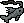
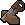

# 🎯 Skills Overview

> [!tip] Overview
> Skills are a fundamental aspect of Kano, representing your character's abilities and expertise in various areas. Each skill can be trained to achieve a maximum level of 99, with some skills offering additional benefits at virtual levels beyond 99.

| Skills | Description | Skills | Description |
|---|---|---|---|
| 
<strong>Attack</strong>
 | Increases accuracy | 
<strong>Defence</strong>
 | Reduces damage |
| 
<strong>Hitpoints</strong>
 | Health | 
<strong>Magic</strong>
 | Spellcasting |
| 
<strong>Prayer</strong>
 | Combat buffs | 
<strong>Ranged</strong>
 | Archery |
| 
<strong>Strength</strong>
 | Increases damage | 
<strong>Farming</strong>
 | Crops/herbs |
| 
<strong>Fishing</strong>
 | Catch fish | 
<strong>Hunter</strong>
 | Catch creatures |
| 
<strong>Mining</strong>
 | Extract ores | 
<strong>Woodcutting</strong>
 | Cut trees |
| 
<strong>Cooking</strong>
 | Prepare food | 
<strong>Crafting</strong>
 | Jewelry/leather |
| 
<strong>Fletching</strong>
 | Bows/arrows | 
<strong>Herblore</strong>
 | Potions | 
<strong>Runecraft</strong>
 | Runes |
| 
<strong>Smithing</strong>
 | Metal items | 
<strong>Agility</strong>
 | Shortcuts |
| 
<strong>Construction</strong>
 | Construct a home | 
<strong>Firemaking</strong>
 | Burn |
| 
<strong>Slayer</strong>
 | Monster hunting | 
<strong>Thieving</strong>
 | Stealing |

## 📊 Experience System

### 📈 Level Progression
> [!note] Level System
> - Start at level 1
> - Max level: 99
> - Virtual levels beyond 99
> - XP doubles every ~7 levels

### 🎯 Key Milestones
> [!note] Important Levels
> - Level 50: Mid-tier content
> - Level 70: High-level content
> - Level 80: Elite content
> - Level 90: Best-in-slot
> - Level 99: Skill cape

## 💰 Money Making

### 💎 Resource Skills
> [!tip] Gathering Profits
> - Mining valuable ores
> - Fishing rare fish
> - Hunting unique creatures
> - Cutting special trees

### 🏭 Production Skills
> [!tip] Crafting Profits
> - Smithing high-level items
> - Crafting jewelry
> - Making potions
> - Building furniture

## 📚 Useful Resources

### 🎮 Game Guides
> [!tip] Essential Reading
> - [Getting Started Guide](/guides/getting-started) - Learn the basics
> - [Combat Guide](/skills/combat) - Master combat mechanics
> - [Money Making Guide](/guides/money-making) - Earn gold efficiently
> - [Bossing Guide](/guides/bossing) - Defeat powerful bosses

### 💰 Money Making
> [!tip] Profit Methods
> - [Skilling Money Making](/guides/money-making/skilling) - Make money through skills
> - [Bossing Money Making](/guides/money-making/bossing) - Profit from boss drops
> - [Merchanting Guide](/guides/money-making/merchanting) - Trade for profit
> - [Daily Money Making](/guides/money-making/daily) - Regular income methods

## 🎯 Training Guides

### ⚔️ Combat Training
> [!note] Combat Skills
> - [Attack Training](/skills/combat/attack) - Increase accuracy
> - [Strength Training](/skills/combat/strength) - Deal more damage
> - [Defence Training](/skills/combat/defence) - Reduce damage taken
> - [Ranged Training](/skills/combat/ranged) - Master archery
> - [Magic Training](/skills/combat/magic) - Learn powerful spells

### 🛠️ Skilling Guides
> [!note] Other Skills
> - [Gathering Skills](/skills/gathering) - Resource collection
> - [Production Skills](/skills/production) - Item creation
> - [Support Skills](/skills/support) - Utility skills
> - [Artisan Skills](/skills/artisan) - Crafting and processing

## 🎮 Advanced Content

### 🐉 Bossing
> [!tip] Boss Guides
> - [God Wars Dungeon](/guides/bossing/gwd) - Defeat powerful gods
> - [Wilderness Bosses](/guides/bossing/wilderness) - Risk vs reward
> - [Raids](/guides/bossing/raids) - Team-based challenges
> - [Solo Bosses](/guides/bossing/solo) - One-player challenges

### 🏆 Minigames
> [!tip] Fun Activities
> - [Pest Control](/guides/minigames/pest-control) - Combat training
> - [Wintertodt](/guides/minigames/wintertodt) - Firemaking training
> - [Temple Trekking](/guides/minigames/temple-trekking) - Combat & rewards
> - [Barbarian Assault](/guides/minigames/barbarian-assault) - Team combat

## 🚀 Getting Started

1. 🎯 Choose your first skill
2. 🛠️ Get basic equipment
3. 📈 Start training
4. 💰 Make some profit
5. 🎮 Progress to better methods

---

> [!tip] Pro Tip
> Focus on training skills that complement each other. For example, training Mining and Smithing together can be more efficient than training them separately. Check out our [Money Making Guide](/guides/money-making) to learn how to profit while training!

> [!warning] Note
> Some training methods may require completion of specific quests or achievement diaries to access. Check the individual skill guides for detailed requirements.
